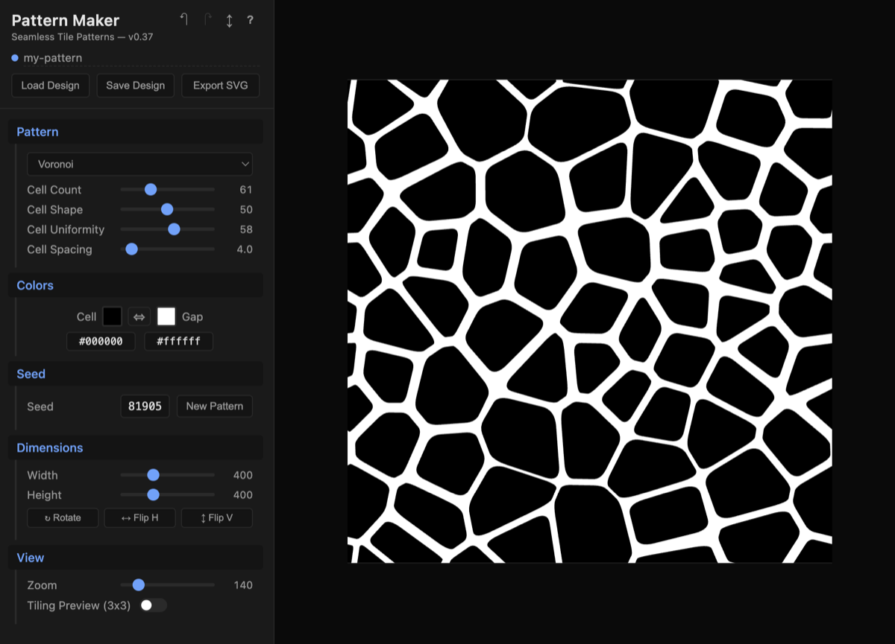
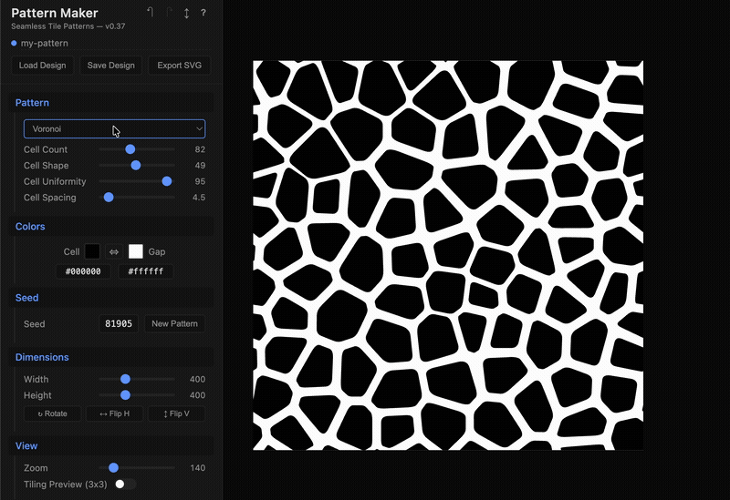
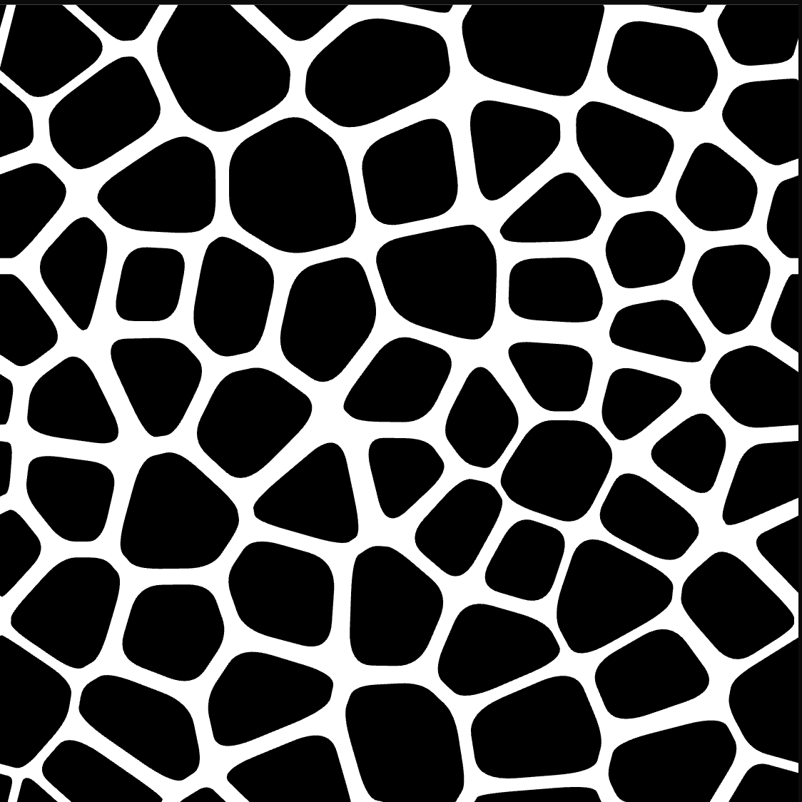
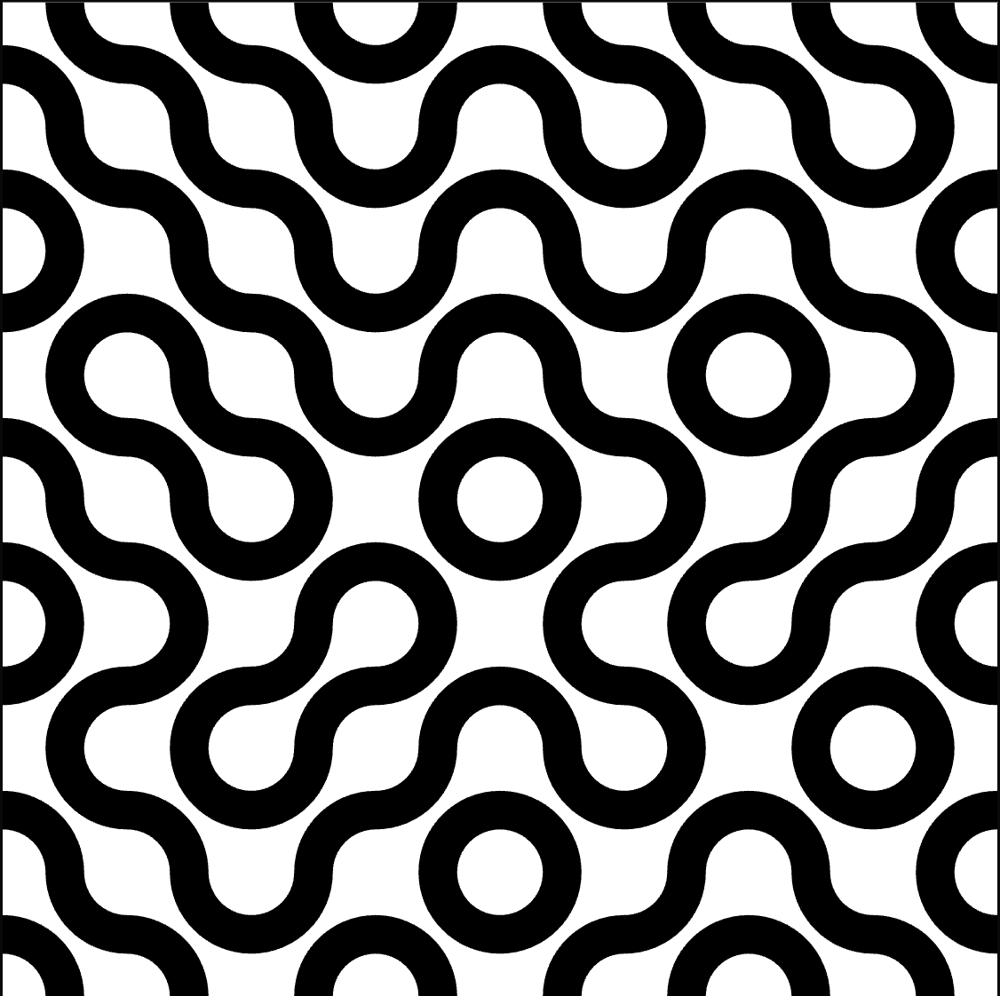
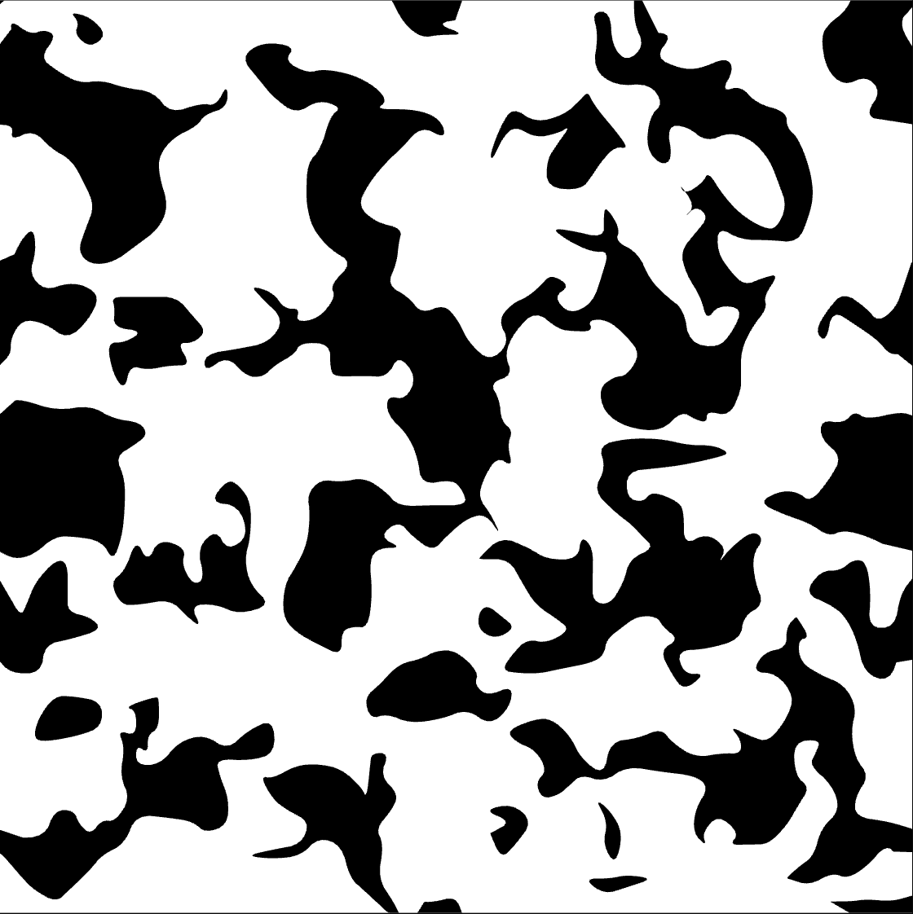
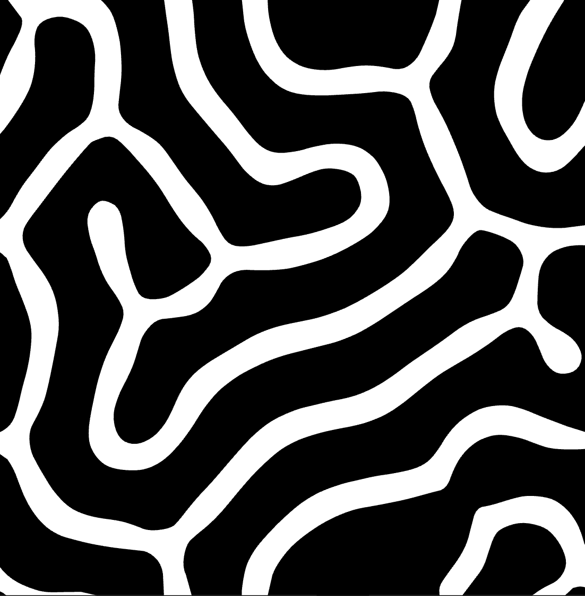
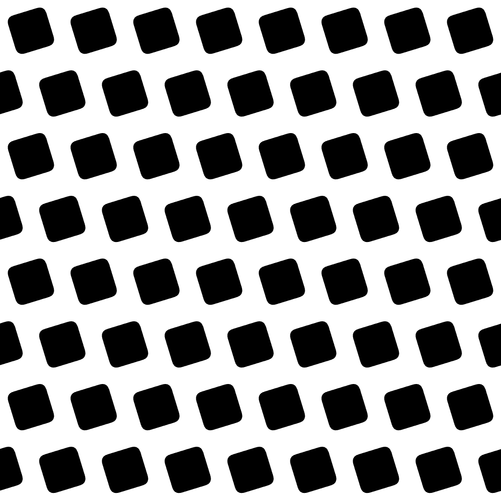

# Pattern Maker

Seamless tile pattern generator for laser cutting, printing, and applying to physical objects. Adjust sliders, see results instantly, and export clean SVG files. All patterns tile perfectly and use only two colors.

**[Use it now at patternmaker.dcity.org](https://patternmaker.dcity.org)** — no download or install required.

Patterns pair perfectly with **[VaseMaker](https://vasemaker.dcity.org)** — export an SVG here, then apply it as a texture to a 3D-printable vase.





## Pattern Gallery

<table>
<tr>
<td align="center"><br><b>Voronoi</b><br>Organic cells with rounded edges</td>
<td align="center"><br><b>Truchet</b><br>Interlocking quarter-arc curves</td>
<td align="center"><br><b>Rorschach</b><br>Warped noise inkblot shapes</td>
</tr>
<tr>
<td align="center"><br><b>Reaction-Diffusion</b><br>Labyrinth from Gray-Scott simulation</td>
<td align="center"><br><b>Shapes Aligned</b><br>Rounded squares on a diagonal grid</td>
<td align="center"></td>
</tr>
</table>

12 pattern types in total: Voronoi, Truchet, Masonry, Cityscape, Rorschach, Reaction-Diffusion, Circle Packing, Fractal Carpet, Fractal Hilbert, Fractal Peano, Shapes Aligned, and Shapes Scattered.

## Features

- **12 pattern types** ranging from organic (Voronoi, Rorschach) to geometric (Truchet, Shapes) to simulation-based (Reaction-Diffusion)
- **Seamless tiling** — every pattern tiles perfectly, verifiable with the built-in 3x3 preview
- **Two-color output** — designed for laser cutting, screen printing, and surface application
- **Real-time preview** — adjust any slider and see the result instantly
- **Undo/Redo** — full history with keyboard shortcuts (Cmd+Z / Cmd+Shift+Z)
- **Save/Load** — save designs as JSON, reload them later with identical results
- **SVG export** — clean vector output, no strokes, ready for fabrication
- **Seed-based** — every pattern is deterministic; same seed = same result
- **Built-in help** — in-app help panel with documentation for all patterns and controls

## Getting Started

No build step required. Open `app/index.html` in a browser, or run a local server:

```bash
cd app
python3 -m http.server 8080
```

Then visit http://localhost:8080

## Tech Stack

- Pure HTML/CSS/JavaScript (no framework, no build step)
- [d3-delaunay](https://github.com/d3/d3-delaunay) via ESM CDN import (Voronoi, Cityscape, and Shapes Scattered patterns)
- Deployed to [Vercel](https://vercel.com)

## License

[MIT](LICENSE)
